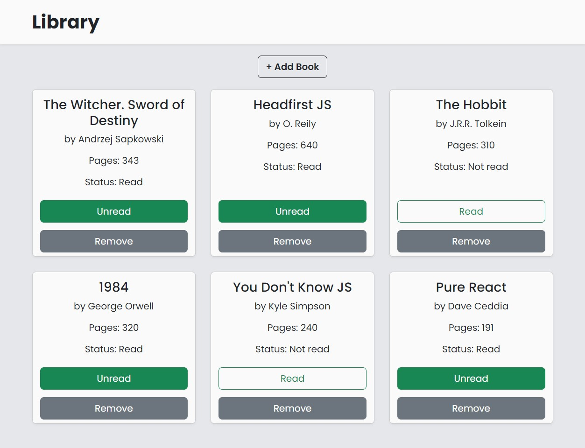

# The Odin Project - JavaScript Course

## Project: Library

## [Live](https://alexign473.github.io/library/)

A Library App. 
The library can be used to locally store information about books the user is reading/has read. They can add information including book title, author, number of pages and whether or not they have read it. 
Within the page, click '+ Add Book' to add a new book, the remove button to delete book, and the Read/Unread button to toggle the read status of the book. All changes should be saved if you reload the page in the same browser.

## Built with

- HTML, CSS and JS
- Bootstrap
- ESLint + Airbnb JavaScript Style Guide
- Prettier

## Installation

You don't need to install the app to run it locally. Just open index.html in your browser or start the live server.  
For development, if you need ESlint and Prettier, install their extensions for your editor. Then install the packages: run `npm install` in your terminal. Requires Node >= 16, npm >= 7.
